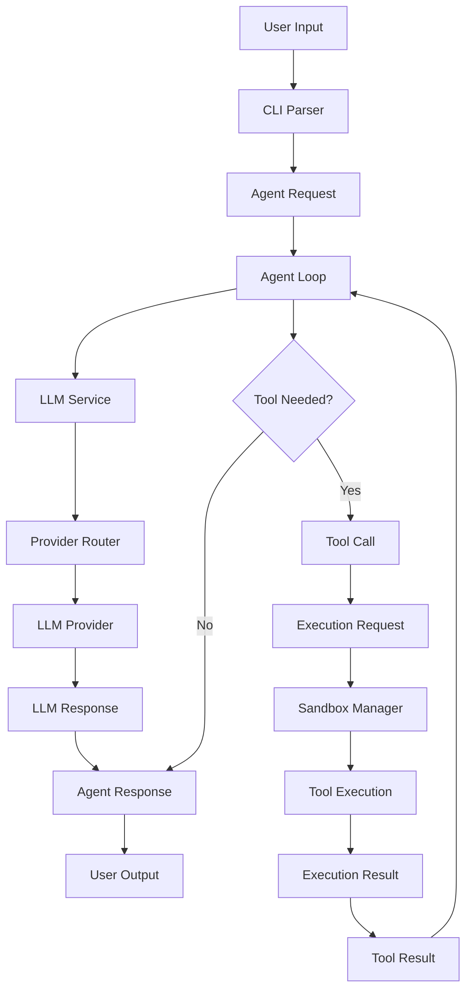
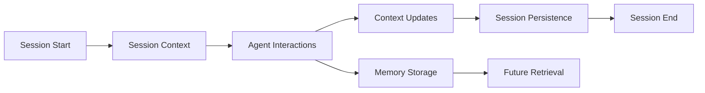
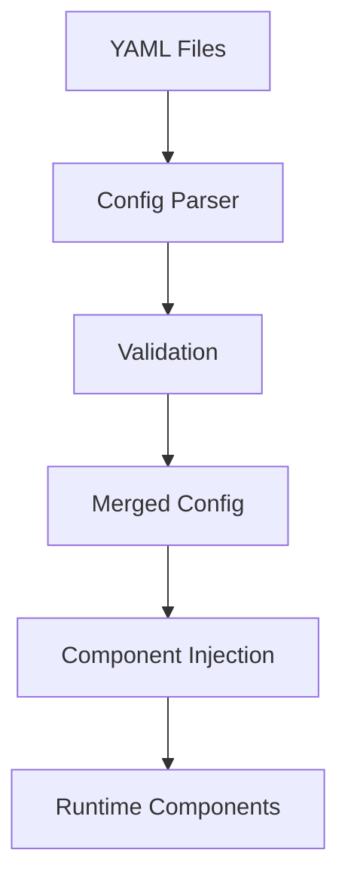
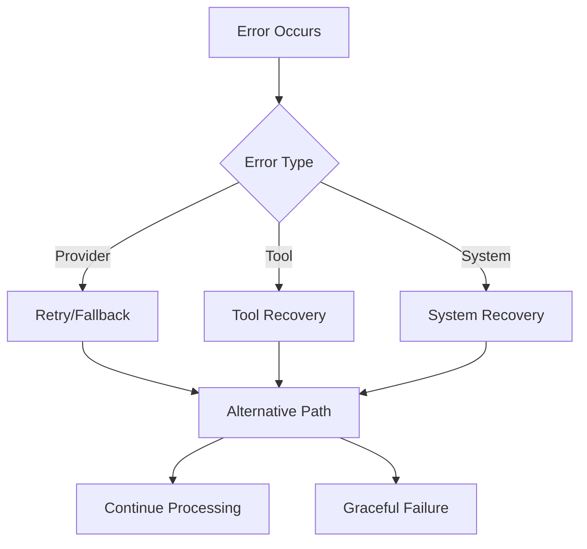

# Data Flow

This document describes how data flows through LOCCA's components and contracts.

## Request Processing Flow

## Key Data Transformations

### Input Processing
- Raw CLI args → Structured `AgentRequest`
- User queries → Parsed intent and context

### LLM Interaction
- `AgentRequest` → `LLMRequest` with provider-specific formatting
- Raw LLM output → Parsed `LLMResponse` with metadata

### Tool Execution
- LLM tool calls → `ToolCall` objects
- `ToolCall` → `ToolExecutionRequest` using sandbox if available and enabled
- Tool output → `ToolExecutionResponse` with metrics

### Response Generation
- Agent reasoning + tool results → `AgentResponse`
- `AgentResponse` → Formatted user output

## State Management

### Session Data Flow

### Configuration Flow

## Error Handling Flow

## Performance Monitoring

### Metrics Collection
- Execution times for each component
- Resource usage (CPU, memory)
- API call statistics
- Error rates and recovery success

### Data Flow Tracking
- Request tracing through components
- Bottleneck identification
- Optimization opportunities

## Security Boundaries

### Data Isolation
- User data segregated by session
- Tool execution in sandboxed environments
- API keys encrypted and isolated

### Access Control
- Component-level permissions
- Sandbox resource limits
- Network access restrictions

## Extensibility Points

### Custom Data Flows
- Plugin interfaces for new components
- Custom data transformers
- Alternative routing logic

### Monitoring Integration
- Custom metrics collectors
- External logging systems
- Performance dashboards

## Next Steps

- [Components](components.md)
- [Contracts](../architecture/contracts.md)
