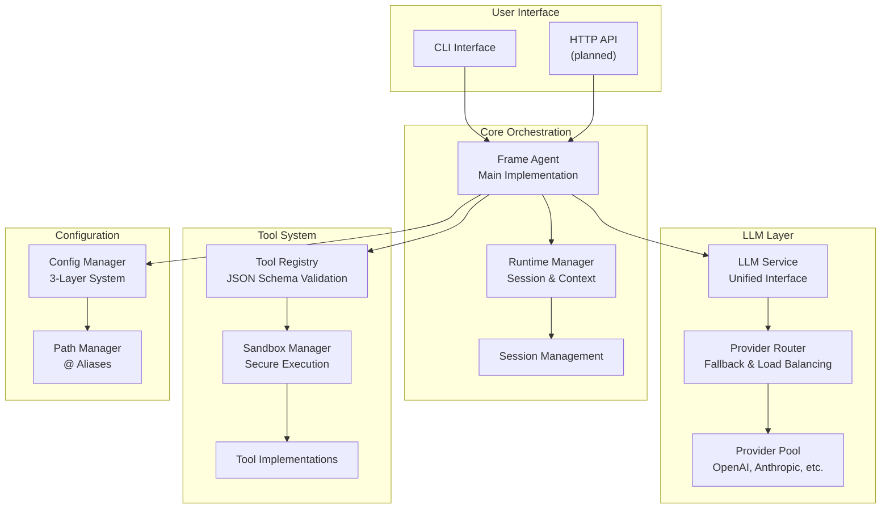
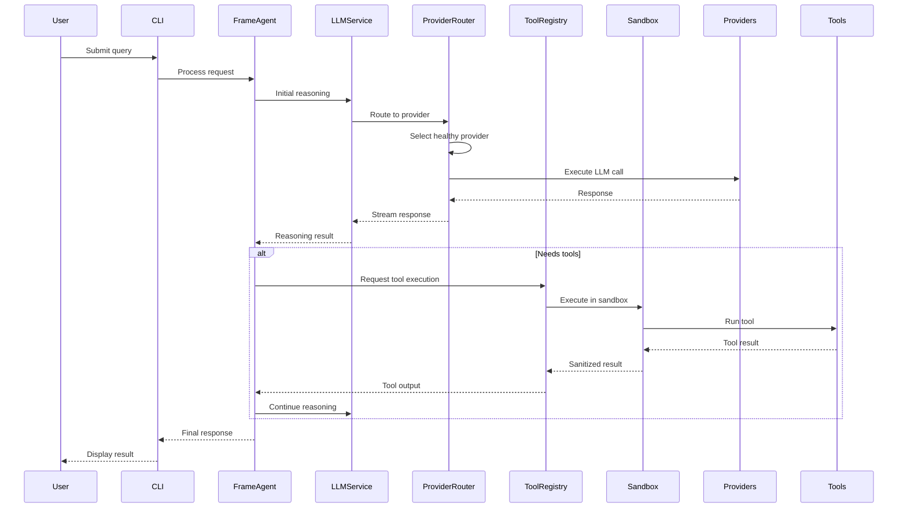
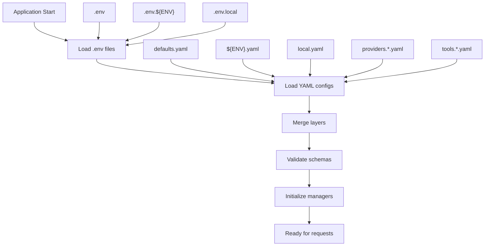

# Architecture Overview

This document provides a detailed overview of LOCCA's architecture, including key components, their interactions, and the overall system design.

## System Architecture

LOCCA implements a sophisticated agent architecture designed for local AI-powered coding assistance. The system is built with modularity, extensibility, and reliability in mind.

## Core Components

### Frame Agent

The heart of LOCCA's intelligence. The main agent implementation that executes tasks using flexible frames:

- **Execution Frames**: Configurable execution patterns for different task types
- **Tool Integration**: Seamless integration with the tool system
- **Context Awareness**: Maintains session context across interactions

### LLM Service Layer

Provides a unified interface for language model interactions:

- **Streaming Support**: Real-time response streaming
- **Provider Abstraction**: Consistent API across different LLM providers
- **Routing & Fallback**: Automatic provider selection and failover
- **Telemetry**: Performance monitoring and usage tracking

### Provider System

Manages external LLM providers with advanced features:

- **Layered Configuration**: Global, session, and call-level overrides
- **Health Monitoring**: Automatic provider health checks
- **Fallback Routing**: Seamless switching between providers
- **Dynamic Loading**: Runtime provider discovery and registration

### Tool System

Extensible tool framework for agent capabilities:

- **JSON Schema Validation**: Type-safe tool interfaces
- **Sandbox Execution**: Secure, isolated tool running
- **Registry System**: Dynamic tool discovery and management
- **Streaming Tools**: Support for long-running tool operations

### Runtime Management

Handles session lifecycle and context persistence:

- **Session Management**: Context-aware conversation handling
- **Execution Engine**: Asynchronous task orchestration
- **Resource Tracking**: Memory and CPU usage monitoring
- **Cancellation Support**: Graceful interruption of long-running tasks

### Configuration System

Three-layer configuration hierarchy:

1. **Global Layer**: Base configuration from YAML and environment
2. **Session Layer**: Runtime overrides for session duration
3. **Call Layer**: Per-request overrides supplied by CLI flags

Includes path management with `@` aliases for cross-platform compatibility.

## Data Flow Patterns

### Request Processing Flow

### Configuration Loading Flow

## Security Model

- **Sandbox Isolation**: All tool execution happens in secure Docker containers
- **Resource Limits**: CPU, memory, and time constraints on tool execution
- **Input Validation**: Strict validation of all external inputs
- **Secure Configuration**: Sensitive data handling with environment variables

## Performance Considerations

- **Async Everywhere**: All I/O operations are asynchronous
- **Connection Pooling**: Efficient provider connection management
- **Caching**: Configuration and provider metadata caching
- **Streaming**: Real-time responses to minimize perceived latency

## Extensibility Points

- **Custom Providers**: Easy addition of new LLM providers
- **Tool Development**: Simple tool registration and validation
- **Agent Patterns**: Pluggable agent loop implementations
- **Configuration Extensions**: Custom configuration sources and schemas

## Monitoring & Observability

- **Structured Logging**: Consistent logging across all components
- **Metrics Collection**: Tool execution statistics and performance data
- **Health Checks**: Provider and system health monitoring
- **Error Tracking**: Comprehensive error handling and reporting
